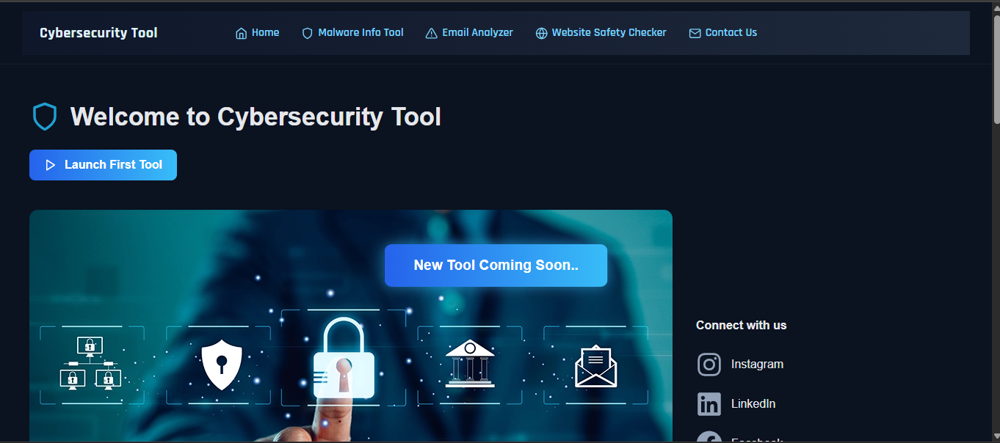
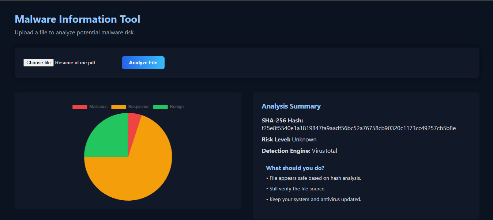
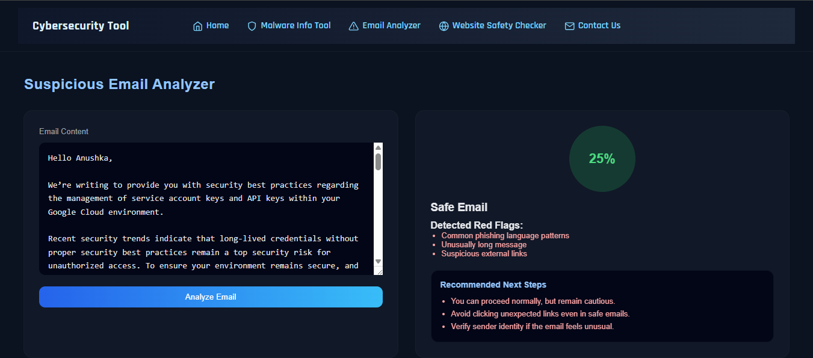
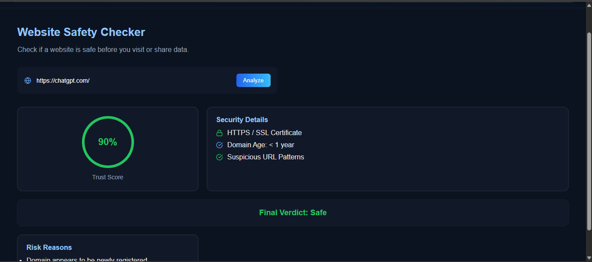

# Cybersecurity Tool

A web-based Cybersecurity Tool developed to help users perform basic security analysis through a simple and user-friendly interface. The application provides three primary security modules:

* Malware Information Tool
* Suspicious Email Analyzer
* Website Safety Checker

The project is designed for educational and learning purposes and demonstrates fundamental cybersecurity concepts such as malware detection, file hashing, threat intelligence integration, email validation, and website security analysis.

---

## Features

### 1. Malware Information Tool

The Malware Information Tool allows users to upload a file for security analysis.

#### Functionality

* Upload files through a web interface
* Generate SHA-256 hash of uploaded files
* Perform VirusTotal hash lookup using VirusTotal API
* Display:

  * File Hash
  * Number of Malicious Detections
  * Number of Suspicious Detections
  * Number of Benign Detections
  * Risk Level
* Visualize results using a Pie Chart
* Automatically delete uploaded files after analysis
* No file storage or scan history retention

#### Technologies Used

* Node.js
* Express.js
* Multer
* Crypto (SHA-256 Hashing)
* VirusTotal API
* React
* Chart.js

---

### 2. Suspicious Email Analyzer

The Suspicious Email Analyzer helps users evaluate email addresses and identify potentially suspicious email patterns.

#### Functionality

* Email format validation
* Domain verification checks
* Identification of suspicious email structures
* User-friendly analysis output

#### Purpose

To increase awareness of phishing attempts and unsafe email practices.

---

### 3. Website Safety Checker

The Website Safety Checker helps users analyze website URLs and identify basic security indicators.

#### Functionality

* URL validation
* HTTPS verification
* Detection of suspicious URL structures
* Website risk assessment

#### Purpose

To help users understand whether a website follows basic security practices before visiting it.

---

## Project Architecture

The application follows a Client-Server Architecture.

### Frontend

Built using:

* React.js
* CSS
* Chart.js

Responsibilities:

* User Interface
* File Upload
* Displaying Analysis Results
* Data Visualization

### Backend

Built using:

* Node.js
* Express.js

Responsibilities:

* API Handling
* SHA-256 Hash Generation
* VirusTotal Integration
* Security Analysis Logic
* Temporary File Processing

### Database

MySQL is used only for the Feedback Module.

Stored Information:

* Tool Name
* User Feedback
* Rating
* Timestamp

The Malware Analysis Tool itself does not use a database.

---

## Malware Analysis Workflow

1. User uploads a file.
2. Backend receives the file using Multer.
3. SHA-256 hash is generated.
4. VirusTotal API performs hash lookup.
5. Detection statistics are retrieved.
6. Risk level is calculated.
7. Results are returned to frontend.
8. Uploaded file is deleted immediately after analysis.

---

## Security Features

* SHA-256 File Hashing
* VirusTotal Threat Intelligence Integration
* No User Authentication Required
* No Personal Data Collection
* No File Storage
* Automatic File Deletion After Analysis
* Environment Variable Protection for API Keys

---

## Technology Stack

### Frontend

* React.js
* CSS
* Chart.js
* React ChartJS 2

### Backend

* Node.js
* Express.js
* Multer
* Axios
* Crypto
* Dotenv

### Database

* MySQL (Feedback Module Only)

### External Service

* VirusTotal API

---

## Installation

### Clone Repository

```bash
git clone <repository-url>
cd cybersecurity-tool
```

### Install Frontend Dependencies

```bash
cd frontend
npm install
```

### Install Backend Dependencies

```bash
cd backend
npm install
```

### Configure Environment Variables

Create a `.env` file inside backend:

```env
PORT=5000

DB_HOST=localhost
DB_USER=root
DB_PASSWORD=your_password
DB_NAME=cybersecurity_tool

VT_API_KEY=your_virustotal_api_key
```

### Start Backend

```bash
cd backend
npm run dev
```

### Start Frontend

```bash
cd frontend
npm run dev
```

---

## Project Objectives

* Demonstrate practical cybersecurity concepts
* Implement malware detection using threat intelligence
* Promote cybersecurity awareness
* Provide a beginner-friendly security analysis platform
* Learn full-stack web development and API integration

---

## Limitations

* VirusTotal lookup depends on existing hash records
* New or unknown malware may not be detected
* Website analysis provides basic security checks only
* Email analysis does not perform live mailbox verification
* Intended for educational purposes and not as a replacement for enterprise security solutions

---

## Future Enhancements

* Real-time URL reputation checking
* Advanced phishing detection
* Malware behavior analysis
* Threat reporting dashboard
* User authentication and role management
* Scan history management
* Additional threat intelligence integrations

---

## Screenshots

### Home Page


### Malware Tool


### Email Analyzer


### Website Safety Checker

 ---
## Author

Anushka Nagvekar

Bachelor of Science in Computer Science

Project: Cybersecurity Tool
